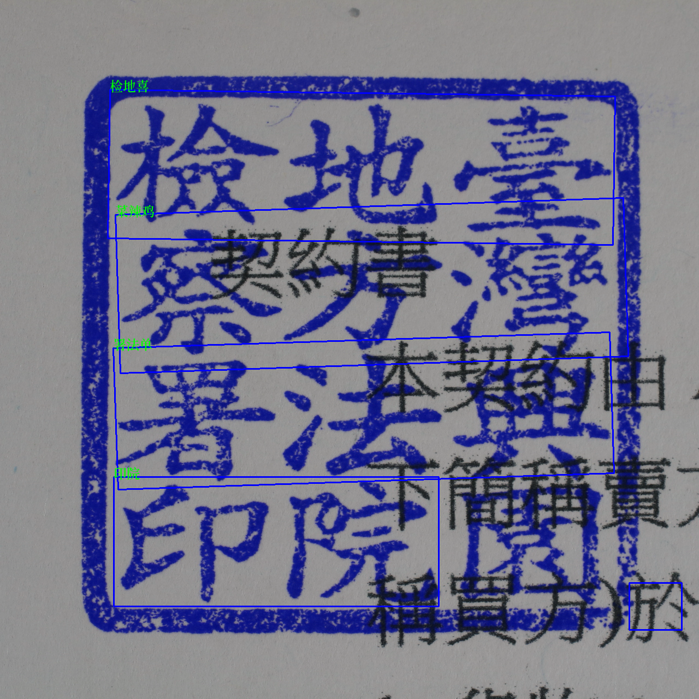

# AIGO-Fraudulent-Seal-Recognition

# 詐騙文件印鑑與關防圖章辨識系統

此專案包含參加 113 年度 AIGO 潛力新星盃競賽開發的程式碼與報告，專案旨在建立一個基於 AI 的系統，用於辨識和分類詐騙文件上的印章和關防圖章，以協助執法單位（高雄市政府警察局刑事鑑識中心）快速、有效地進行辨識與分析。

## 目錄

- [專案背景](#專案背景)
- [技術概述](#技術概述)
- [專案結構](#專案結構)
- [功能特色](#功能特色)
- [安裝與使用](#安裝與使用)
- [範例程式碼](#範例程式碼)
- [成果展示](#成果展示)
- [參考資源](#參考資源)
- [授權條款](#授權條款)

## 專案背景

專案旨在解決詐騙文件辨識的三大挑戰：

1. **辨識難度高**：警方無法快速辨識文件上的印鑑真偽，需回傳警局進一步確認，延誤偵辦時效。
2. **資料未能妥善利用**：尚無完善系統整合與分析印鑑資料，影響案件處理效率。
3. **溯源困難**：詐騙集團利用多層斷點，難以追查主謀。

## 技術概述

解決方案結合以下技術：

- **Vision Transformer (ViT)**：用於圖像特徵提取。
- **對比學習 (Contrastive Learning)**：增強特徵鑑別能力。
- **GANs**：生成數據增強樣本，解決資料不平衡。
- **DenseNet121**：用於印章中文字的特徵提取。
- **CnOCR**：進行文字區域檢測與文字辨識。

## 專案結構

專案包含以下檔案與程式碼：

- `contractive-learning.ipynb`：示範對比學習技術的應用。
- `final_v1.py`：架設 streamlit 網站。
- `font-test-1.ipynb`：分析印章中文字字型（隸書、楷書、篆體...）。
- `generate-image.ipynb`：使用 GANs 生成樣本影像。
- `img_preprocess.ipynb`：影像資料集的前處理步驟。
- `ocr.py`：利用 CnOCR 進行印章影像中的文字辨識。
- `save_feature.py`：提取並保存影像特徵的程式碼。

## 功能特色

- **高準確率**：印章和關防圖章辨識準確率達 98% 以上。
- **數據增強**：使用 GANs 生成多樣樣本，數據集規模超過 5000 張。
- **即時處理**：每張圖片的處理時間小於 0.5 秒。
- **雙重特徵提取**：結合圖像與文字特徵，提高分類準確率。
- **自動化分析流程**：減少人工錯誤與時間成本。

## 安裝與使用

```bash
git clone https://github.com/ccJolene/AIGO-Fraudulent-Seal-Recognition.git
cd AIGO-Fraudulent-Seal-Recognition
```

## 範例程式碼

以下為印章影像文字辨識程式碼範例（`ocr.py`）：

```python
from cnocr import CnOcr
import cv2

# 初始化 CnOCR 模型
ocr = CnOcr()

# 讀取影像
image_path = 'sample_stamp_image.png'
image = cv2.imread(image_path, cv2.IMREAD_GRAYSCALE)

# 進行文字辨識
ocr_result = ocr.ocr(image)

# 顯示辨識結果
for line in ocr_result:
    print("".join([word['text'] for word in line]))
```

## 成果展示



### 定量成果
- **辨識準確率**：超過 98%。
- **影像處理時間**：小於 0.5 秒。

### 定性成果
- 透過自動化印章辨識，提高案件偵辦效率。
- 增強資料庫利用，減少標記資料成本。

## 參考資源

- [Vision Transformer](https://pytorch.org/vision/main/models/vision_transformer.html)
- [CnOCR 官方文件](https://cnocr.readthedocs.io/zh-cn/stable/)
- [DenseNet 介紹](https://pytorch.org/hub/pytorch_vision_densenet/)
- [Streamlit](https://streamlit.io/)

